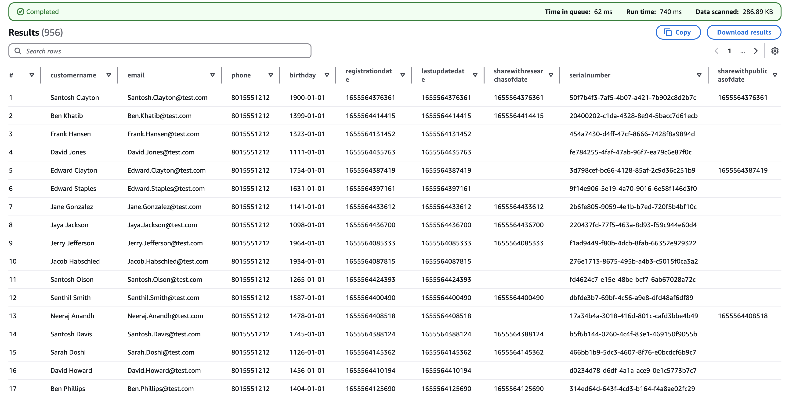
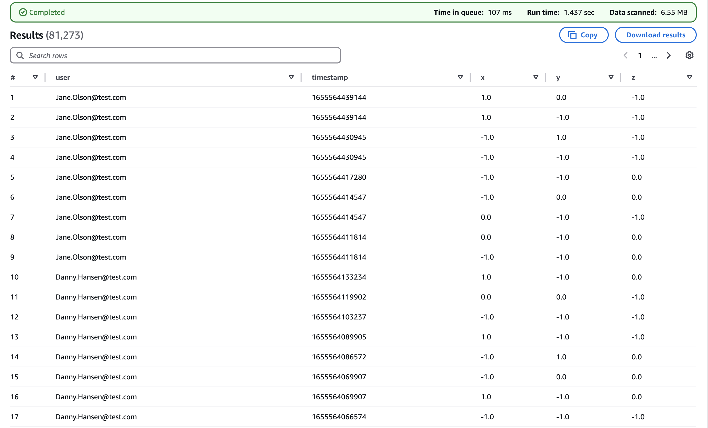
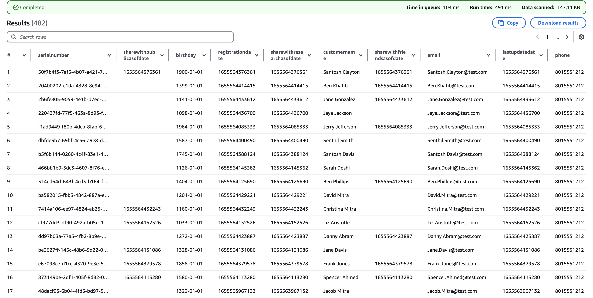
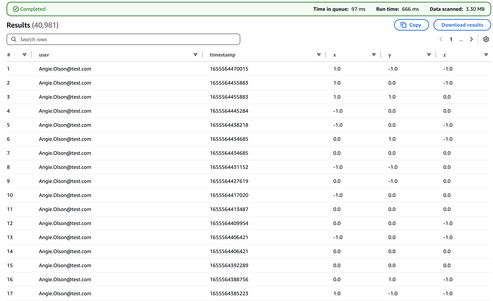
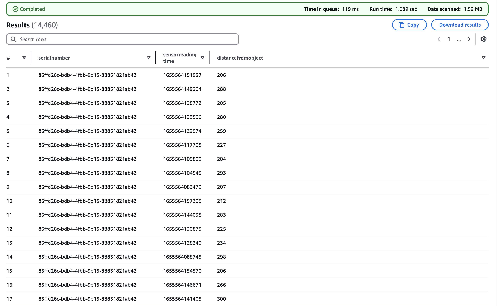
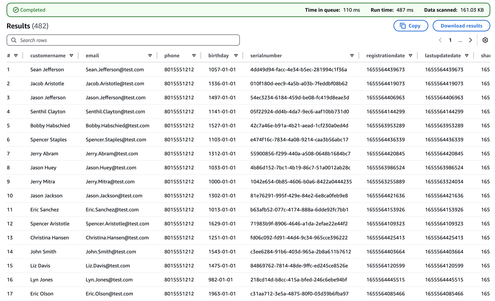
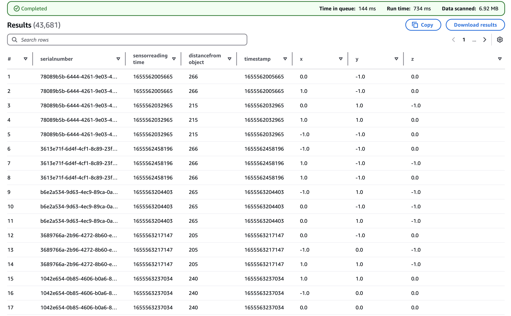
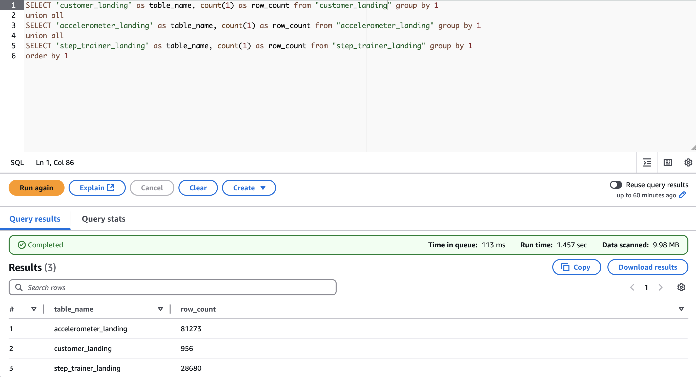
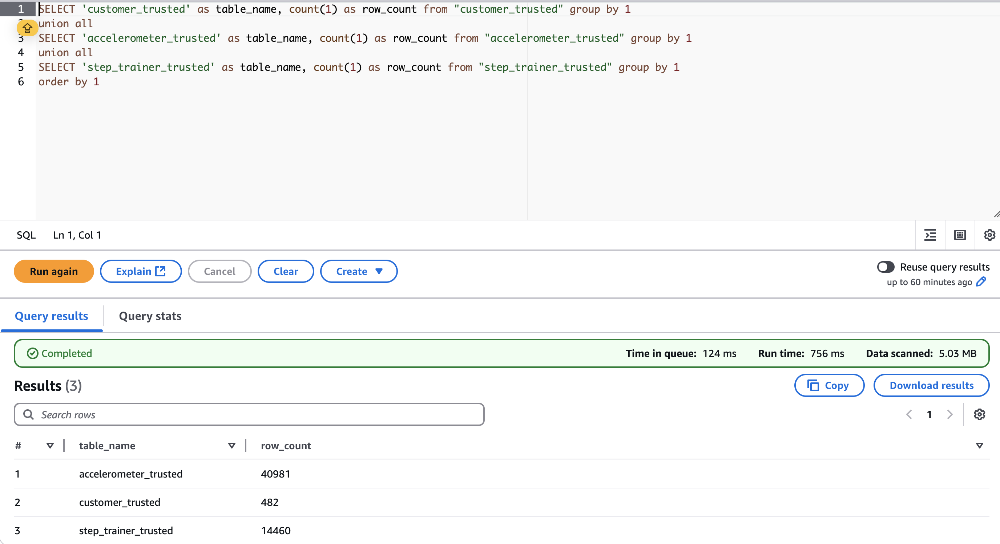
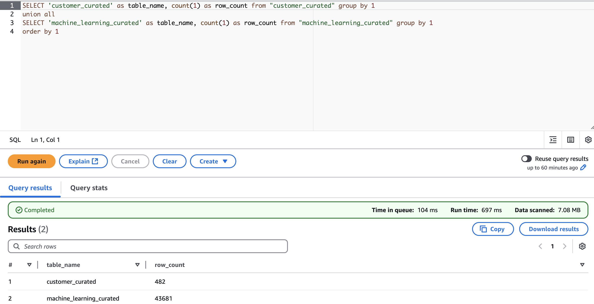

## Project Overview
This project demonstrates the creation of a data lakehouse solution to process sensor and mobile app data collected from the STEDI Step Trainer. Using **AWS Glue**, **Spark**, **S3**, and **Python**, the system is designed to enable advanced machine learning models to detect steps accurately while prioritizing data privacy.

The solution integrates raw data from motion sensors embedded in the STEDI Step Trainer and companion mobile applications. It showcases a comprehensive end-to-end data engineering pipeline, transforming raw data into trusted and curated datasets for analytics and machine learning.

## Key Objectives
- **Data Ingestion**: Extract sensor and customer data from various sources.
- **Data Transformation**: Sanitize and filter raw data, prioritizing privacy compliance.
- **Data Curation**: Aggregate and integrate data for machine learning and analytics.
- **Machine Learning Enablement**: Create high-quality datasets to train models for accurate real-time step detection.

---

## Project Details: The STEDI Step Trainer
The STEDI Step Trainer combines innovative hardware and software:
- **Balance Training**: Helps users perform balance exercises.
- **Motion Sensors**: Capture step data using distance detection.
- **Mobile Application**: Utilizes accelerometer data (X, Y, Z directions) to detect motion.

Privacy considerations drive the data pipeline design, ensuring that only data from customers who have consented to research is processed.

---

## Data Engineering Workflow

### 1. Landing Zone
The landing zone stores raw, unprocessed data ingested from various sources.

#### Artifacts:
- Glue Tables:
  - **Customer Landing Table**: [customer_landing.sql](./scripts/customer_landing.sql)
  - **Accelerometer Landing Table**: [accelerometer_landing.sql](./scripts/accelerometer_landing.sql)
  - **Step Trainer Landing Table**: [step_trainer_landing.sql](./scripts/step_trainer_landing.sql)

#### Example Queries:
Screenshots of sample queries executed in Athena:
- **Customer Landing Table**:  
  

- **Accelerometer Landing Table**:  
  

- **Step Trainer Landing Table**:  
  

---

### 2. Trusted Zone
Data in the trusted zone is processed to ensure privacy compliance and enhanced quality for analytical purposes.

#### Data Transformation:
- **Scripts**:
  - [customer_landing_to_trusted.py](./scripts/customer_landing_to_trusted.py): Filters sensitive data and selects customers who consented to data sharing.
  - [accelerometer_landing_to_trusted.py](./scripts/accelerometer_landing_to_trusted.py): Filters accelerometer data for consented customers.
  - [step_trainer_landing_to_trusted.py](./scripts/step_trainer_landing_to_trusted.py): Populates `step_trainer_trusted` with consented user data.

#### Example Queries:
Screenshots of trusted zone tables:
- **Customer Trusted Table**:  
  

- **Accelerometer Trusted Table**:  
  

- **Step Trainer Trusted Table**:  
  

---

### 3. Curated Zone
The curated zone contains aggregated and integrated data ready for advanced analytics and machine learning.

#### Data Curation:
- **Scripts**:
  - [customer_trusted_to_curated.py](./scripts/customer_trusted_to_curated.py): Filters curated customer data based on consent and availability of accelerometer data.
  - [machine_learning_curated.py](./scripts/machine_learning_curated.py): Aggregates step trainer and accelerometer data for machine learning models.

#### Example Queries:
Screenshots of curated zone tables:
- **Customer Curated Table**:  
  

- **Machine Learning Curated Table**:  
  

---

## Technical Highlights
- **AWS Glue Jobs**:
  - Built Glue jobs for data sanitization, transformation, and aggregation.
  - Used Transform - SQL Query nodes for efficient data joins and transformations.
- **Athena Queries**:
  - Validated data quality and compliance at each stage.
  - Ensured table row counts aligned with expected outputs.
- **Privacy Compliance**:
  - Processed only consented customer data throughout the pipeline.

---

## Verification Checklist
### Table Row Counts:
- **Landing Zone**:  
  

- **Trusted Zone**:  
  

- **Curated Zone**:  
  
---

